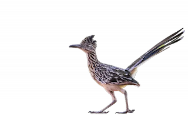

### Hey!👋

Hello!
I'm **Brooks**, an insatiably curious data enthusiast with a strong passion for all things data. I love building ETL pipelines, supporting ML, engineering, and analytics teams, and making data accessible.

Here is a list of my **personal projects**:

| **Data Engineering** | **Machine Learning** |
| ---------------------| ---------------------|
| • [CRM Data Loader]() - An automated pipeline which loads customer and sales data from a data warehouse to a CRM application  | • [New Mexico Bird Migration](https://github.com/brooksburkhead/Bird-Migration-Analysis) - Modelling and predicting New Mexico migratory bird pattern changes using a Polynomial Regression model  • [Wikipedia NLP]() - Uses Natural Language Processing and Wikipedia's API to find the 10 most similar people to a any person found in Wikipedia  • [Spotify Song Popularity]() - Random Forest Model that predicts the popularity of a song on Spotify based on song features. 

#### Tech Stack:

Python / Pandas / NumPy / scikit-learn / PyTorch / SQL / Databricks / Snowflake / dbt / AWS / GCP / Linux / git / github   

